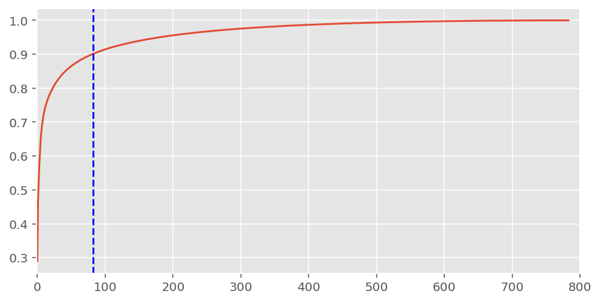
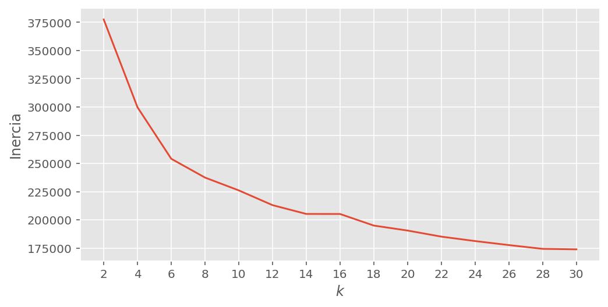
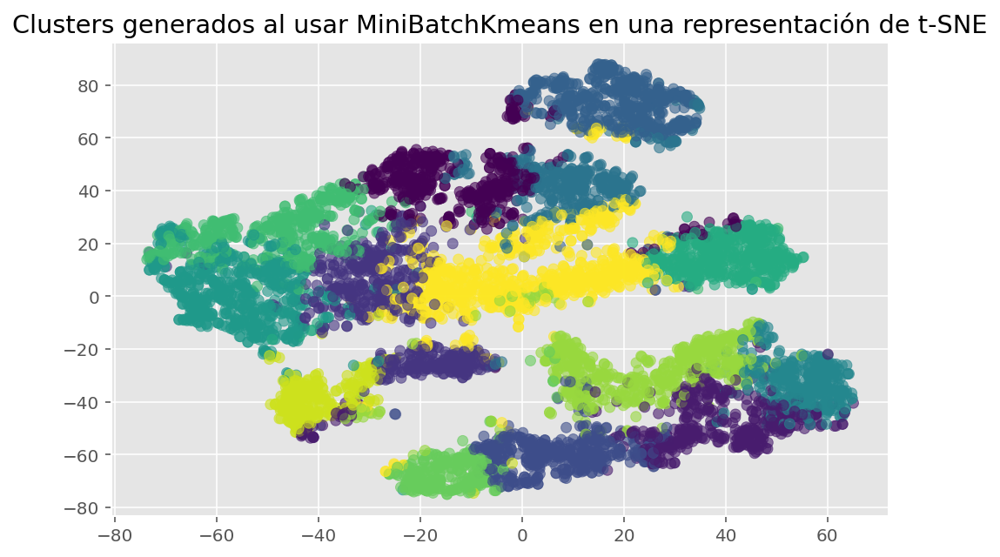
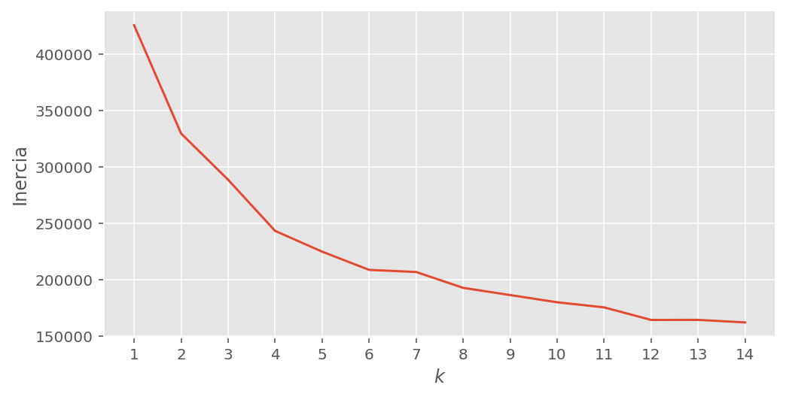
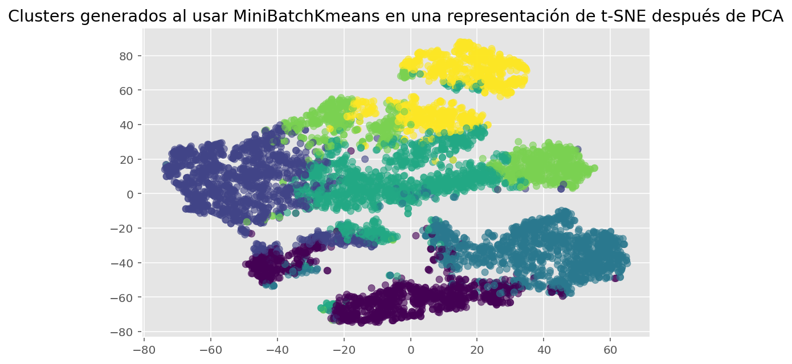
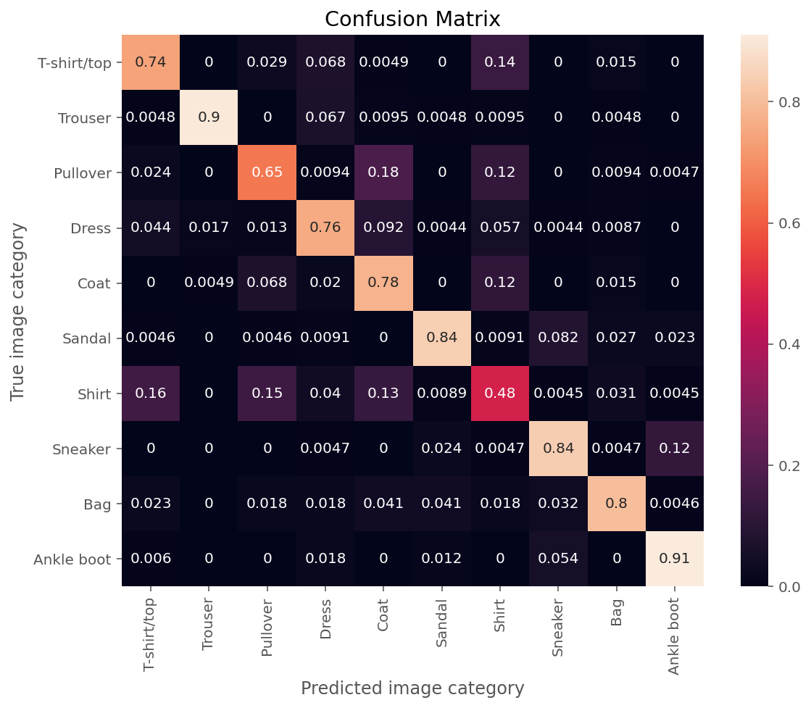
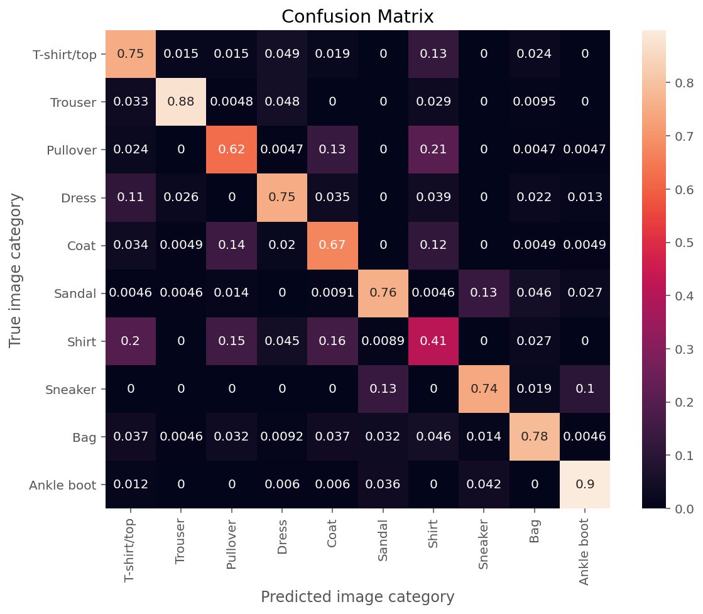

# Clothes prediction models

The following objectives are developed in this project:

* Analyze the Fashion-MNIST image dataset to extract explicit and implicit information from the dataset for the benefit of a company that wants to predict the type of clothes found in a given image for expediting processes processes such as customer service.
* Perform different image visualization techniques and apply pre-processing techniques on the images and the labels of the dataset, so that they optimize the results of the models to be implemented.
* Implement supervised and unsupervised machine learning models that lead to predictions and/or classification of the analyzed images, taking into account the search for the best hyperparameters for better results.
* Evaluate the models built with metrics that require or not image labels, in order to know the reliability and usefulness of the trained models and choose the best option for the dataset analyzed.

## About this project

Inside of each folder of this project can be found the following procedures:

* 1. EDA: The dataframes containing the images and labels to be used are loaded and an exploratory analysis is done, including the visualization of those images.
* 2. Models: This folder contains the files: [PCA.ipynb](https://github.com/cagutierrezgu/My_Portfolio/blob/9213e638d45ded01d044777bd70f6d5a568afc1c/Clothes%20image%20classification/2.%20Models/1.%20PCA.ipynb), [K_Means.ipynb](https://github.com/cagutierrezgu/My_Portfolio/blob/9213e638d45ded01d044777bd70f6d5a568afc1c/Clothes%20image%20classification/2.%20Models/2.%20K_Means.ipynb) and [Trees.ipynb](https://github.com/cagutierrezgu/My_Portfolio/blob/9213e638d45ded01d044777bd70f6d5a568afc1c/Clothes%20image%20classification/2.%20Models/3.%20Trees.ipynb). Dimensionality reduction methods are applied, and machine learning algorithms are made with the data loaded. 
* 3. Evaluation: The models are evaluated with the appropiate metrics in the notebooks: [K_Means_evaluation.ipynb](https://github.com/cagutierrezgu/My_Portfolio/blob/9213e638d45ded01d044777bd70f6d5a568afc1c/Clothes%20image%20classification/3.%20Evaluation/1.%20K_Means_evaluation.ipynb), [Trees_evaluation.ipynb](https://github.com/cagutierrezgu/My_Portfolio/blob/9213e638d45ded01d044777bd70f6d5a568afc1c/Clothes%20image%20classification/3.%20Evaluation/2.%20Trees_evaluation.ipynb)

## Models and results

The images used for the analysis were all of the same size: 28 * 28 pixels. Becasuse of this, it was applied a PCA on those images in order to reduce its size and trained better models later. It was found that, on average, it was needed 82 pixels to explain around the 90% of the variance as is shown below

After doing this procedure, it was trained a grouping or cluster model known as K-Means with the original images (all the pixels), and training it for many number of clusters, it was made the next inertia graphic

Choosing k=14 clusters to graphically see the generated clusters, it is obtained the next figure after using a t-SNE representation:

The previous graph shows that the generated clusters are distributed almost throughout the plane and in some cases there seems to be no spatial separation between one and the other, which may also be due to the representation generated by t-SNE, which could not be the best to get an optimal visualization for these clusters and their differences.

This procedure was repeated on the set to which PCA was applied and these are its results:

It is chosen a number k=6 of clusters to observe their results graphically:

In this case, fewer clusters generated by K-Means were chosen, but it is still not possible to determine with certainty what is the appropriate number of clusters for the set of images.

On the other hand, it was also made tree decision classifier models for this set of images. An analysis was made to find the best depth of them and the partition criteria that maximized the metric scores using cross validation. The results for the model with the original images are the following

And the ones for the images with the PCA representation

The differences between both sets of images are not significant, but the most important result is the behaviour of the shirt's predictions, because it is seen from both images that there are several problems trying to distinguish it from the rest clothing.

## Conclusions

The most relevant findings seen throughout the analysis done are the ones shown below:

* An analysis was done using some of the images uploaded from the web [Kaggle](https://www.kaggle.com/datasets/zalando-research/fashionmnist?select=fashion-mnist_train.csv), letting the creation of models of grouping and supervised learning that can be useful for subsequent implementations in clothing companies that want to speed up activities such as customer service.
* The use of methods such as t-SNE and PCA were of great help to make a good preprocessing over the studied images, despite this, the graphs of the t-SNE representations left in doubt the performance of this method for the data used, since there was no clear distinction between types of clothes and having to appeal to other types of models.
* The K-Means clustering techniques and the decision tree model were implemented in order to make predictions and classify the available data. In addition, other tools such as Gridsearch were used to find the best set of hyperparameters and thus improve the results of the models.
* Different evaluation metrics were used to measure the results obtained from the trained models, which showed that for the images used, the model that best suited was the decision tree model. Likewise, the results obtained with the lower dimension data compared to the originals were quite similar, which can be analyzed deeply in future studies by varying the number of images used, as well as the amount of explained variance of the PCA.
